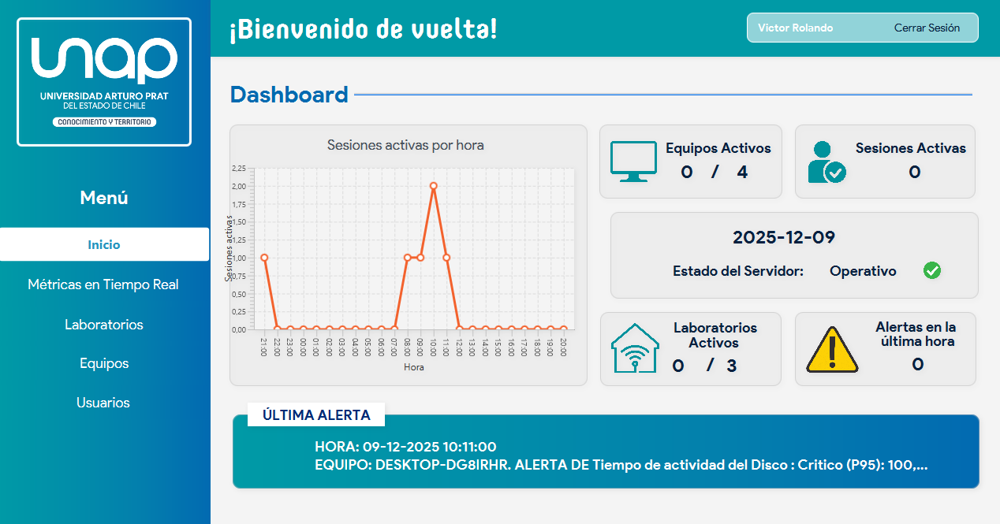
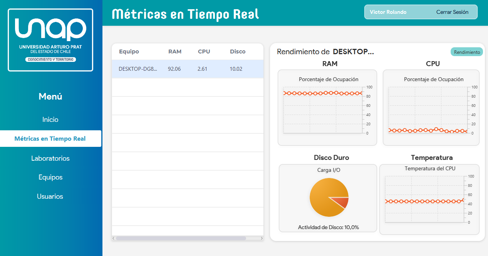
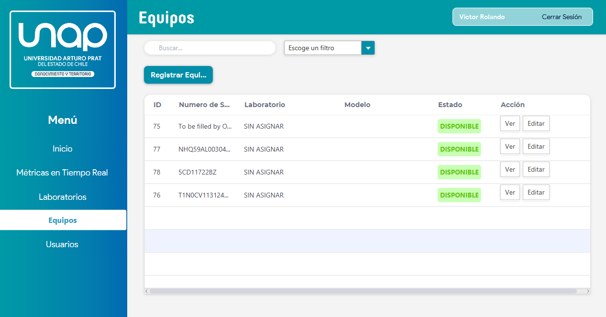
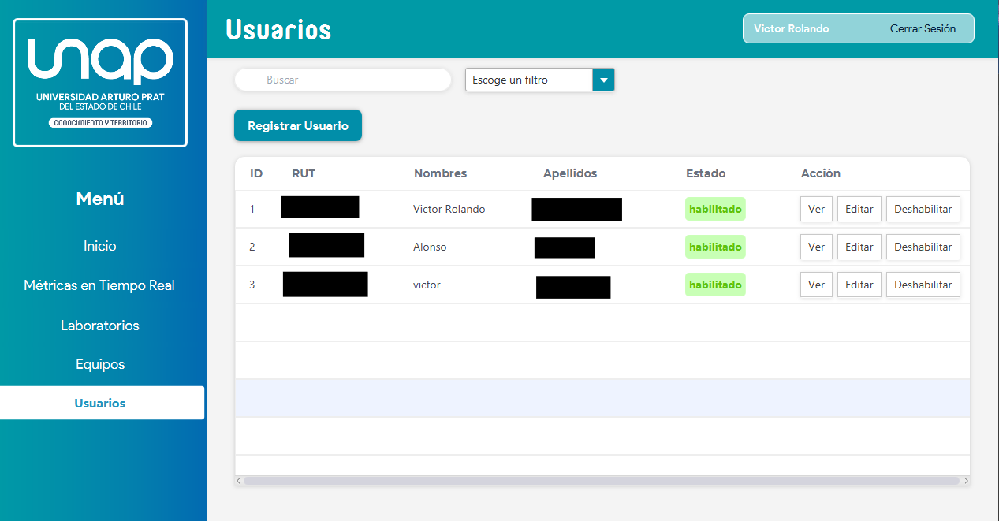

# 🖥️ Sistema de Monitoreo de Laboratorios - UNAP

<div align="center">


**Sistema integral para el monitoreo en tiempo real de equipos en laboratorios universitarios**

[Descargar Windows](../../releases) · [Descargar macOS](../../releases) · [Reportar Bug](../../issues) · [Solicitar Feature](../../issues)

</div>

---

## 📖 Descripción

Sistema de **monitoreo de computadores** diseñado para laboratorios universitarios. Permite supervisar en tiempo real el estado de los equipos, gestionar usuarios, laboratorios y visualizar métricas de rendimiento (CPU, RAM, disco, temperatura).

Desarrollado en **Java** con **JavaFX** para la interfaz gráfica, conexión a **PostgreSQL** mediante **HikariCP** y arquitectura en capas siguiendo el patrón **DAO**.

### ✨ Características Principales

- 📊 **Monitoreo en tiempo real** - CPU, RAM, disco y temperatura
- 👥 **Gestión de usuarios** - Roles de administrador y monitor
- 🏢 **Gestión de laboratorios** - Control de capacidad y estado
- 💻 **Gestión de equipos** - Inventario completo con especificaciones
- 🔔 **Sistema de alertas** - Notificaciones de métricas críticas
- 📈 **Dashboard interactivo** - Gráficos de sesiones y estadísticas
- 🔐 **Autenticación segura** - Contraseñas hasheadas con BCrypt
- 🌐 **Conexión remota** - Túnel seguro con Cloudflare

---

## 🖼️ Capturas de Pantalla

<details>
<summary>Ver capturas</summary>

| Dashboard | Monitoreo Tiempo Real |
|:---------:|:---------------------:|
|  |  |

| Gestión de Equipos | Gestión de Usuarios |
|:------------------:|:-------------------:|
|  |  |

</details>

---

## 🚀 Instalación

### Requisitos del Sistema

| Requisito | Windows | macOS |
|-----------|---------|-------|
| Sistema Operativo | Windows 10/11 | macOS 10.15+ (Catalina o superior) |
| RAM | 4 GB mínimo | 4 GB mínimo |
| Espacio en disco | 200 MB | 250 MB |
| Conexión a internet | ✅ Requerida | ✅ Requerida |

> **Nota:** No necesitas tener Java instalado. La aplicación incluye su propio JRE.

---

### 📥 Windows

1. **Descarga** el archivo `MonitorApp-Windows.zip` desde [Releases](../../releases)

2. **Extrae** el contenido en cualquier ubicación

3. **Ejecuta** `start.bat`

```
MonitorApp-Windows/
├── jre/                 ← Java Runtime incluido
├── cloudflared.exe      ← Túnel de conexión
├── monitor-app.jar      ← Aplicación
└── start.bat            ← ⬅️ Ejecutar esto
```

---

### 🍎 macOS

1. **Descarga** el archivo `MonitorApp-Mac.zip` desde [Releases](../../releases)

2. **Extrae** el contenido (doble clic en el ZIP)

3. **Abre Terminal** y ejecuta:

```bash
cd ~/Downloads/MonitorApp-Mac
chmod +x start.sh cloudflared-x64 cloudflared-arm64
./start.sh
```

4. **Si aparece advertencia de seguridad:**
   - Ve a `Configuración del Sistema` → `Privacidad y Seguridad`
   - Busca el mensaje sobre la app bloqueada
   - Haz clic en `Abrir de todos modos`

```
MonitorApp-Mac/
├── jre-x64/             ← Java para Mac Intel
├── jre-arm64/           ← Java para Mac Apple Silicon
├── cloudflared-x64      ← Túnel para Intel
├── cloudflared-arm64    ← Túnel para Apple Silicon
├── monitor-app.jar      ← Aplicación
└── start.sh             ← ⬅️ Ejecutar esto
```

> **Compatibilidad macOS:**
> - ✅ Mac Intel (2012-2020)
> - ✅ Mac Apple Silicon M1/M2/M3/M4 (2020+)

---

## 🛠️ Tecnologías Utilizadas

### Backend
| Tecnología | Uso |
|------------|-----|
| Java 21 | Lenguaje principal |
| PostgreSQL 16 | Base de datos |
| HikariCP | Pool de conexiones |
| BCrypt | Hash de contraseñas |
| JDBC | Conectividad BD |

### Frontend
| Tecnología | Uso |
|------------|-----|
| JavaFX 21 | Interfaz gráfica |
| CSS3 | Estilos personalizados |
| FXML | Diseño de vistas |

### Infraestructura
| Tecnología | Uso |
|------------|-----|
| Cloudflare Tunnel | Conexión segura remota |
| Adoptium Temurin | JRE portable |
| Maven | Gestión de dependencias |

---

## 🏗️ Arquitectura

```
┌─────────────────────────────────────────────────────────────┐
│                        CLIENTE                              │
├─────────────────────────────────────────────────────────────┤
│  ┌─────────────┐  ┌─────────────┐  ┌─────────────────────┐  │
│  │   JavaFX    │  │    FXML     │  │        CSS          │  │
│  │    Views    │  │   Layouts   │  │      Styles         │  │
│  └──────┬──────┘  └──────┬──────┘  └─────────────────────┘  │
│         │                │                                   │
│         ▼                ▼                                   │
│  ┌─────────────────────────────────────────────────────┐    │
│  │              Controllers (JavaFX)                    │    │
│  └──────────────────────┬──────────────────────────────┘    │
│                         │                                    │
│                         ▼                                    │
│  ┌─────────────────────────────────────────────────────┐    │
│  │              AppContext (Singleton)                  │    │
│  └──────────────────────┬──────────────────────────────┘    │
└─────────────────────────┼───────────────────────────────────┘
                          │
┌─────────────────────────┼───────────────────────────────────┐
│                    SERVIDOR                                  │
├─────────────────────────┼───────────────────────────────────┤
│                         ▼                                    │
│  ┌─────────────────────────────────────────────────────┐    │
│  │                 Controllers                          │    │
│  │    (UsuarioController, EquipoController, etc.)       │    │
│  └──────────────────────┬──────────────────────────────┘    │
│                         │                                    │
│                         ▼                                    │
│  ┌─────────────────────────────────────────────────────┐    │
│  │                  Services                            │    │
│  │     (Lógica de negocio, validaciones)                │    │
│  └──────────────────────┬──────────────────────────────┘    │
│                         │                                    │
│                         ▼                                    │
│  ┌─────────────────────────────────────────────────────┐    │
│  │                    DAOs                              │    │
│  │         (Acceso a datos, queries SQL)                │    │
│  └──────────────────────┬──────────────────────────────┘    │
│                         │                                    │
└─────────────────────────┼───────────────────────────────────┘
                          │
                          ▼
                ┌─────────────────┐
                │   PostgreSQL    │
                │   (Cloudflare   │
                │     Tunnel)     │
                └─────────────────┘
```

---

## 👥 Roles de Usuario

| Rol | Permisos |
|-----|----------|
| **ADMIN** | Crear, editar, habilitar/deshabilitar usuarios, equipos y laboratorios. Acceso completo. |
| **MONITOR** | Ver información de usuarios, equipos y laboratorios. Monitoreo en tiempo real. Solo lectura. |

---

## 📁 Estructura del Proyecto

```
proyecto-lab/
├── src/main/java/proyecto/lab/
│   ├── client/
│   │   ├── application/        # App, AppContext, CloudflaredManager
│   │   └── controllers/        # Controladores de vistas JavaFX
│   └── server/
│       ├── config/             # Conexión a BD (HikariCP)
│       ├── controller/         # Controladores de negocio
│       ├── dao/                # Data Access Objects
│       ├── dto/                # Data Transfer Objects
│       ├── exceptions/         # Excepciones personalizadas
│       ├── models/             # Entidades (Usuario, Equipo, etc.)
│       ├── security/           # Utilidades de autenticación
│       ├── service/            # Lógica de negocio
│       └── utils/              # Utilidades (RUT, validaciones)
├── src/main/resources/
│   ├── fonts/                  # Fuentes personalizadas
│   ├── styles/                 # Archivos CSS
│   └── views/                  # Archivos FXML
└── pom.xml                     # Configuración Maven
```

---

## ⚙️ Desarrollo

### Requisitos para Desarrolladores

- Java JDK 21+
- Maven 3.8+
- PostgreSQL 16
- IntelliJ IDEA (recomendado)

### Clonar y Ejecutar

```bash
# Clonar repositorio
git clone https://github.com/tu-usuario/proyecto-lab.git
cd proyecto-lab

# Compilar
mvn clean package

# Ejecutar
java -jar target/monitor-app.jar
```

### Variables de Entorno

Crea un archivo `.env` en la raíz del proyecto:

```env
DB_URL=jdbc:postgresql://localhost:5432/proyecto_lab
DB_USER=tu_usuario
DB_PASSWORD=tu_contraseña
```

---

## 🔄 Changelog

### v2.0.0 (Diciembre 2025) - **Actual**
- 🍎 **Nuevo:** Soporte para macOS (Intel y Apple Silicon)
- 🚀 **Nuevo:** Detección automática de arquitectura en Mac
- 📦 **Nuevo:** Distribución portable (no requiere Java instalado)
- 🔧 **Mejora:** CloudflaredManager multiplataforma
- 📝 **Mejora:** Documentación actualizada

### v1.0.0 (Octubre 2025)
- 🎉 Lanzamiento inicial
- ✅ Soporte Windows
- ✅ Monitoreo en tiempo real
- ✅ Gestión de usuarios, equipos y laboratorios
- ✅ Sistema de alertas
- ✅ Dashboard con estadísticas

---

## 🐛 Solución de Problemas

<details>
<summary><b>Windows: "No se encuentra cloudflared.exe"</b></summary>

Asegúrate de que `cloudflared.exe` está en la misma carpeta que `start.bat`.
</details>

<details>
<summary><b>macOS: "La aplicación no se puede abrir porque proviene de un desarrollador no identificado"</b></summary>

1. Ve a `Configuración del Sistema` → `Privacidad y Seguridad`
2. Busca el mensaje sobre la app bloqueada
3. Haz clic en `Abrir de todos modos`
4. Ingresa tu contraseña de administrador
</details>

<details>
<summary><b>macOS: "Permission denied" al ejecutar start.sh</b></summary>

Ejecuta en Terminal:
```bash
chmod +x start.sh cloudflared-x64 cloudflared-arm64
chmod +x jre-x64/Contents/Home/bin/java
chmod +x jre-arm64/Contents/Home/bin/java
```
</details>

<details>
<summary><b>Error de conexión a la base de datos</b></summary>

1. Verifica tu conexión a internet
2. El túnel de Cloudflare puede tardar unos segundos en conectarse
3. Intenta ejecutar la aplicación nuevamente
</details>

---

## 👥 Colaboradores

<table>
  <tr>
    <td align="center">
      <a href="https://github.com/VJaraC">
        <br />
        <sub><b>@VJaraC</b></sub>
      </a>
    </td>
    <td align="center">
      <a href="https://github.com/AHidalgoG">
        <br />
        <sub><b>@AHidalgoG</b></sub>
      </a>
    </td>
    <td align="center">
      <a href="https://github.com/dani-pp">
        <br />
        <sub><b>@dani-pp</b></sub>
      </a>
    </td>
    <td align="center">
      <a href="https://github.com/GCasanueva">
        <br />
        <sub><b>@GCasanueva</b></sub>
      </a>
    </td>
  </tr>
</table>

---

## 📄 Licencia

Este proyecto está bajo la Licencia MIT - ver el archivo [LICENSE](LICENSE) para más detalles.

---

<div align="center">

**Universidad Arturo Prat - UNAP**

Hecho con ❤️ en Iquique, Chile

</div>
